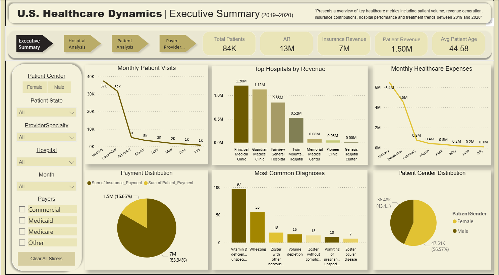

# Healthcare-Analysis
# 🏥 U.S. Healthcare Dynamics — Power BI Dashboard

<p align="center">
  
</p>

 

---

## Overview

A four-page interactive Power BI report analyzing U.S. healthcare operations across **84,000+ patient records** for the period **2019–2020**. The dashboard covers hospital performance, patient demographics, payer distributions, and provider-level revenue — giving stakeholders a 360° view of healthcare dynamics at both macro and granular levels.

> *"Presents an overview of key healthcare metrics including patient volume, revenue generation, insurance contributions, hospital performance and treatment trends between 2019 and 2020."*

---

## Key Metrics at a Glance

| Metric | Value |
|:---|---:|
| Total Patients | **84K** |
| Total Revenue (AR) | **$13M** |
| Insurance Revenue | **$7M** |
| Patient Revenue | **$1.50M** |
| Average Patient Age | **44.58 years** |
| Gender Split | **56.57% Male / 43.43% Female** |
| Insurance vs Patient Payment | **83.34% / 16.66%** |

---

## Dashboard Pages

### 1. Executive Summary


The top-level overview for leadership and stakeholders.

**Visuals included:**
- **Monthly Patient Visits** — Peak in January (37K), sharp decline through July (1K)
- **Top Hospitals by Revenue** — Principal Medical Clinic leads at $1.20M
- **Monthly Healthcare Expenses** — $6.4M in January, tapering to $0.1M by July
- **Payment Distribution** — Donut chart: Insurance $7M (83.34%) vs. Patient $1.5M (16.66%)
- **Most Common Diagnoses** — Vitamin D deficiency (97), Wheezing (55), Zoster w/ nervous system (18)
- **Patient Gender Distribution** — Pie chart showing male/female split

---

### 2. Hospital Analysis


Drills into facility-level performance across patient volume, expenses, and revenue.

**Visuals included:**
- **Patient Volume by Hospital** — Principal Medical Clinic (8.5K) leads all facilities
- **Gross Expense by CPT Grouping** — Hospital ($7.34M), Surgery ($1.41M), Radiology ($1.38M)
- **Provider Specialties Distribution** — Angelstone Community leads; Big Heart at 15.26K
- **Critical Hospital Metrics Overview** — AR, IPTP Ratio, and ARGE Ratio per hospital
- **Monthly Expense of Top Hospitals** — Pioneer Clinic, Principal Medical, Twin Mountains trend lines
- **Top Revenue Generating Hospitals** — Principal Medical ($1.20M), Guardian Medical ($1.12M)
- **Patient Gender Distribution Across Hospitals** — Side-by-side male/female breakdown per facility

---

### 3. Patient Analysis


A patient-centric view of demographics, geography, and diagnosis patterns.

**Visuals included:**
- **Patient Count by Age** — Near-uniform distribution across ages 0–90 (~1K per age group)
- **Patient Directory Table** — Searchable list with full name and email
- **Patients by City** — Woodstock (289), Wilmington (288), York (174) are the top cities
- **Patients by Country** — Global map view (Bing Maps integration)
- **Gender Distribution** — Male 47.51K (56.57%), Female 36.48K (43.43%)
- **Patient Revenue by Diagnosis** — Vomiting leads at $13K, followed by Volume depletion ($12K)
- **Most Common Diagnoses** — Viral infection and Vitamin D deficiency tied at 97 cases each

---

### 4. Payer–Provider Analysis


Revenue and receivables broken down by payer type and provider specialty.

**Visuals included:**
- **Payment Distribution (Insurance vs Patient)** — Monthly comparison; January peaks at $3.7M insurance / $0.8M patient
- **Provider Revenue by Hospital** — Matrix by specialty (Anesthesiology, Behavioral Clinician, Dermatology, etc.)
- **Revenue by Provider Specialty** — Surgery – Vascular ($99K) and Thoracic Surgery ($60K) lead
- **Total Revenue by Provider Name** — Williams tops at $35K, followed by Willis ($12K)
- **Insurance Payment by Payer** — Medicare ($3.9M) > Commercial ($3.4M) > Medicaid ($0.2M) > Other ($0.0M)
- **AR by Payer** — Medicare ($7M), Commercial ($5M), Medicaid ($1M)
- **Adjustments by Payer** — Medicare ($0.80M), Commercial ($0.48M), Medicaid ($0.07M)

---

## Filters & Slicers

All four pages share a consistent, synchronized filter panel on the left:

| Filter | Options |
|:---|:---|
| Patient Gender | Female · Male |
| Patient State | All · Individual U.S. states |
| Provider Specialty | All · Specific specialties |
| Hospital | All · Individual hospitals |
| Month | All · January through July |
| Payers | Commercial · Medicaid · Medicare · Other |

A **Clear All Slicers** button resets the full report to its default state.

---

## Key Findings

- **Medicare dominates** payer volume — contributing $3.9M in insurance payments and $7M in total AR, nearly double commercial payers.
- **Principal Medical Clinic** is the top-performing facility in both patient volume (8.5K) and total revenue ($1.20M).
- **Surgery – Vascular** generates the highest revenue among all provider specialties at $99K.
- **Patient visits dropped sharply** after January 2020 (37K → 1K by July), likely reflecting COVID-19 disruption.
- **Vitamin D deficiency** is the single most common diagnosis with 97 recorded cases, tied with viral infections.
- **Insurance covers 83.34%** of all payments; patients contribute just 16.66% out of pocket.
- **Angelstone Community Hospital** carries the highest AR burden at $5.5M with an IPTP ratio of 0.58.

---

## Repository Structure

```
us-healthcare-dynamics/
│
├── US_Healthcare_Dynamics.pbix       # Power BI report file
│
├── data/
│   └── healthcare_data.csv           # Source dataset
│
├── screenshots/
│   ├── executive_summary.png
│   ├── hospital_analysis.png
│   ├── patient_analysis.png
│   └── payer_provider.png
│
└── README.md
```

---

## Getting Started

### Prerequisites

- [Microsoft Power BI Desktop](https://powerbi.microsoft.com/desktop/) — free, latest version recommended
- Windows OS (Power BI Desktop is Windows-only; use Power BI Service on Mac/Linux via browser)

### Steps

1. **Clone the repository**
   ```bash
   git clone https://github.com/your-HuzaifaZakir15/us-healthcare-dynamics.git
   cd us-healthcare-dynamics
   ```

2. **Open the report**
   - Launch Power BI Desktop
   - Go to **File → Open report** and select `US_Healthcare_Dynamics.pbix`

3. **Explore**
   - Use the navigation tabs at the top to switch between the four pages
   - Apply slicers on the left panel to filter by gender, state, specialty, hospital, month, or payer
   - Click **Clear All Slicers** to reset all filters at once

---

## Tech Stack

| Tool | Purpose |
|:---|:---|
| Power BI Desktop | Report development and visualization |
| DAX | Calculated measures, KPIs, and dynamic titles |
| Power Query (M) | Data transformation, cleaning, and shaping |
| Bing Maps | Geographic patient distribution visual |

---

## Data Model

The report is built on a healthcare dataset with the following key fields:

**Patient:** `PatientID` · `Full Name` · `patientEmail` · `PatientAge` · `PatientGender` · `PatientCity` · `PatientState` · `PatientCountry`

**Clinical:** `Diagnosis` · `CptGrouping` · `ProviderSpecialty` · `ProviderName`

**Facility:** `HospitalName` · `Month`

**Financial:** `Payer` · `Insurance_Payment` · `Patient_Payment` · `AR` · `Adjustments` · `IPTP_Ratio` · `ARGE_Ratio`

---

## License

This project is for educational and portfolio purposes. All patient records are anonymized/simulated and do not represent real individuals.

---

<p align="center">Built with Power BI &nbsp;·&nbsp; Data period: January 2019 – July 2020</p>
